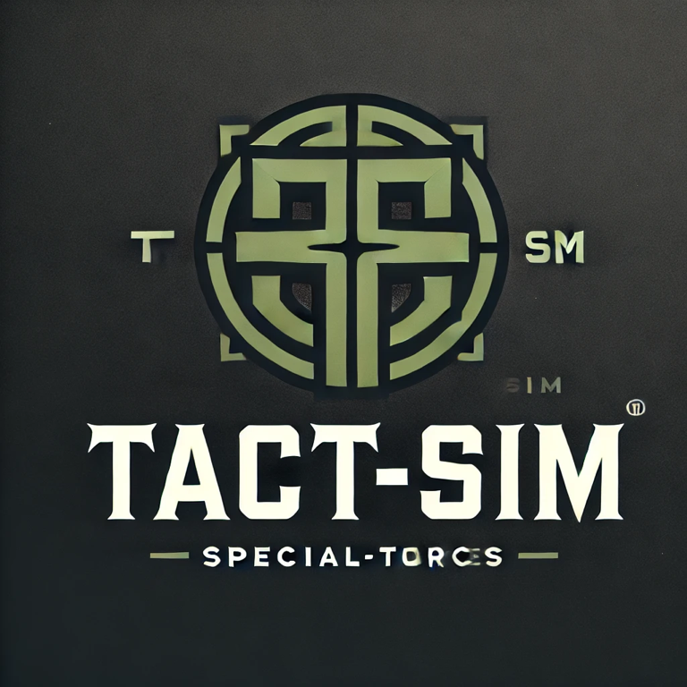

# TACTSIM


**TACTSIM** is an advanced tactical training simulation system designed for real-time positioning, hit detection, and interactive gameplay. Using a combination of Raspberry Pi, ESP32, and various sensors, it provides a robust framework for tactical training with customizable targets and player tracking.

## Features
- **Active and Passive Targets**: Different target modes to simulate realistic scenarios, with hit detection and response capabilities.
- **Positioning and Mapping**: Real-time relative positioning and mapping of players and targets.
- **Beacon System**: Personal tracking beacons for players, integrating hit indication and positional awareness.
- **Mesh Network Communication**: Reliable communication between devices in challenging environments.
- **Game Dashboard**: Central control and monitoring dashboard with configuration and update management.

## Getting Started

### Prerequisites
- Raspberry Pi 3 B+ for the Main System
- Raspberry Pi Zero 2 W for Active Targets
- ESP32 for Passive Targets and Beacons
- Python 3.x and necessary libraries (see `requirements.txt`)

### Installation
1. Clone the repository:
   ```bash
   git clone https://github.com/JenFa-Innovations/TACTSIM.git
   cd TACTSIM
   ```

2. Install the required packages:

    ```bash
    pip install -r requirements.txt
    ```

3. Configure the system and setup as per instructions in each component folder.

### Usage

To start the system, launch the main dashboard:

```bash
  python main_system/source/dashboard.py
```
## Contributing

We welcome contributions! Feel free to open an issue or submit a pull request with your improvements.

## License
This project is licensed under the MIT License - Non-Commercial (NC) Version. See the LICENSE file for details.
## Acknowledgements
- [TensorFlow](https://www.tensorflow.org/) for machine learning frameworks
- [OpenCV](https://opencv.org/) for computer vision tasks
- [Home Assistant](https://www.home-assistant.io/) for home automation integration
